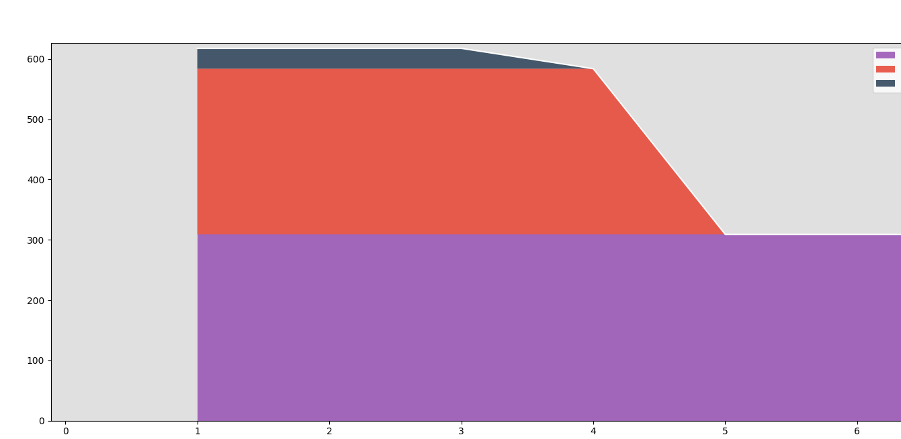

# How to run

---

## Start the script
```shell
poetry shell # only if the virtual environment is not active
poetry run debt_calculator/main.py
```

## Interacting with the script
- You will be presented by two options and based on the choise the behaviour will be dectated:
  - `Enter (a) for adding a new item` 
  - `Enter (p) for plotting current items`

Option (a)
- The user is going to be asked to provide the following information to store the item
  - Item name
  - Total amount
  - Number of installments
  - Installment amount
  - Start date in `dd-mm-yyyy` format
- From that point, the info will be validated for sanity and below info will be calculated
  - End date
  - Remaining installments
  - Remaining amount

Option (p)
- The stored data will be retrieved, updated and plotted in a similar graph representing the amount each item is contributing to the monthly debt and when that would end/ 

# How to run tests

---

```shell
poetry shell # only if the virtual environment is not active 
poetry run pytest
```

# Planned features roadmap
- 🟢 Collect debt data from user (item name, Amount to pay, # of installments and start date)
- 🟢 Validate that debt data are valid 
- 🟢 Store debt in a json file
- 🟢 Calculate remaining debt amount from the moment of entry
- 🟢 Calculate remaining installments from the moment of entry
- 🟢 Activate CI
- 🟢 Graph stackplot for total debt amount with each contributor based on how much is remaining
- 🟢 Bar/Line chart for projected lifetime of the longest payment 
- 🟠 Add tests
- 🟢 Expand README with how to run and expected results
- 🟠 containerise the whole project 
- 🔵 deprecate json file storage and migrate into a database storage with consistent storage
- 🔵 read items from database and construct an internal list of objects to graph

#### Legend
🟢 - Done  
🟠 - In progress  
🔵 - Planned